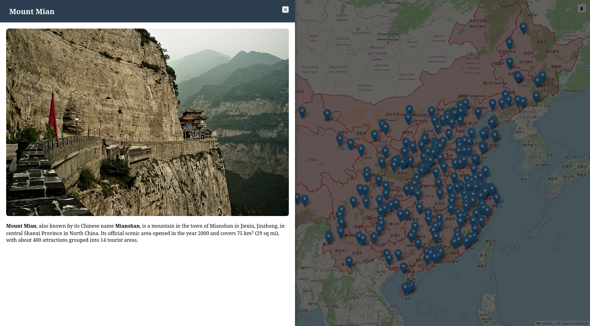

# china_5a

A python project to generate a leaflet map of 5A touristic places in China. Based on wikidata / wikipedia / commons and OSM.

Compatibility: minimum python 3.14

## Installation

```
python3 -m venv venv && . ./venv/bin/activate
python download_wikidata.py
firefox output/webiste/index.html
```

## Capture

